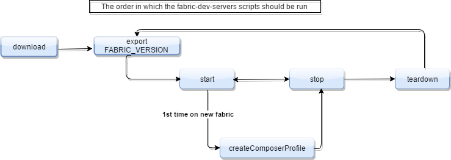

# Hyperledger Composer - Tutorial 2 - Running a local application

Follow the instructions below to get started by standing up a Hyperledger Fabric, and then getting a simple Hyperledger Composer Business Network deployed and an application running against it. A 'Getting Started' application.

This sample application should be run against a v1.0 Hyperledger Fabric (and which the scripts below will stand up as a Dev environment)

## Step 1: Getting Hyperledger Fabric running

These scripts use Node v6, and bash, which are Hyperledger Composer dependencies. Choose a directory that you wish to have the setup scripts within.

1. In a directory of your choice (will assume `~/fabric-tools`) get the zip file that contains the tools.  There are both .zip and .tar.gz formats
```
$ mkdir ~/fabric-tools && cd ~/fabric-tools
$ curl -O https://raw.githubusercontent.com/hyperledger/composer-tools/master/packages/fabric-dev-servers/fabric-dev-servers.zip
$ unzip fabric-dev-servers.zip
```

```
$ mkdir ~/fabric-tools && cd ~/fabric-tools
$ curl -O https://raw.githubusercontent.com/hyperledger/composer-tools/master/packages/fabric-dev-servers/fabric-dev-servers.tar.gz
$ tar xvzf fabric-dev-servers.tar.gz

```

2. If this is the first time you've run this tutorial, you'll need to download the fabric first. If you have already downloaded a set of Fabric images then first start the fabric (see below), and create a Composer profile.  Make sure you don't have a previous network (digitalproperty-network) docker container left running as 'legacy' - remove legacy containers as necessary using `docker rm`). After that, you can then choose to stop the fabric, and start it again later. Alternatively, to completely clean up, you can 'teardown' the Fabric and the Composer profile / sample credentials (see more below).

All the scripts will be in the directory `~/fabric-tools` you created above.  A typical sequence for Hyperledger Composer startup  would be:

```
$ cd ~/fabric-tools
$ ./downloadFabric.sh
$ ./startFabric.sh
$ ./createComposerProfile.sh
```

Then at the end of your development session

```
$ cd ~/fabric-tools
$ ./stopFabric.sh
$ ./teardownFabric.sh
```

## Script details

### Downloading Fabric

Issue the following command from the `fabric-tools` directory:
```
$ ./downloadFabric.sh
```

### Starting Fabric

Issue the following command from the `fabric-tools` directory:
```
$ ./startFabric.sh
```

### Stop Fabric

Issue the following command from the `fabric-tools` directory:
```
$ ./stopFabric.sh
```

By default, this 'start' script will pause for 15 seconds to let Fabric start - on some systems this may not be enough. If you see fails in running `startFabric.sh` you can alter this value - its controlled by a environment variable that takes a numeric value representing the number of seconds to wait.

```
$ export FABRIC_START_TIMEOUT=30
```

### Create Composer Profile

Issue this command from the `fabric-tools` directory
```
$ ./createComposerProfile.sh
```

Note: this create a Hyperledger Composer profile specifically to connect to the development fabric you've already started.

### Teardown Fabric (when you want to 'clean' up and start afresh)

Issue from the `fabric-tools` directory
```
$ ./teardownFabric.sh
```


### Command Ordering

This diagram should to clarify the order in which the scripts can be run.  

.


# Step 2: Getting the Hyperledger Composer sample application (the Digital Property CLI sample application) up and running

1. Make sure you've started Fabric as in Step 1 above. For example, If this is your first time for example

```
$ cd ~/fabric-tools
$ ./downloadFabric.sh
$ ./startFabric.sh
$ ./createComposerProfile.sh
```

2. Clone the sample application into a directory of your choice - BUT not the same directory as in Step 1. (Assume `~/github')
```
$ mkdir ~/github && cd ~/github
$ git clone https://github.com/hyperledger/composer-sample-applications
$ cd composer-sample-applications
$
```

OPTIONAL: To see a summary of all the sample applications, there's a simple command that will show summary details of the sample applications available in this repository. A useful information node.js script has been created to show the available sample applications - note you will need to run `npm install` from the current directory (takes about 5-10 mins) before running this command.
```
$ node ~/github/composer-sample-applications/info.js
```

3. Deploy the business network (for example - deploying the Digital Property sample application)

```
$ cd packages/digitalproperty-app
$ npm install
$ npm run deployNetwork
```

4. Bootstrap Assets, Participants and run the sample application (Digital Property sample, for example)
```
$ npm test
```


